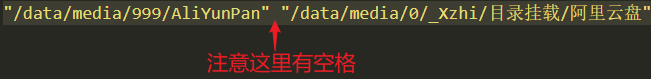

    <h1>Xzhi-自定义目录挂载</h1>
    
    
    
    
    
【自定义目录挂载】Magisk模块，适用于已经root的安卓手机。

## 作用

这模块有啥作用呢？举几个例子：

- 挂载目录下的文件不会占用手机原有的空间大小，挂载目录可以理解为**共享目录**，**注意：**如果在挂载目录下增加、删除、修改文件，对应的源目录也会跟着增加、删除、修改文件。

- 用MX播放器可以直接播放应用双开路径下的视频（其实手机没有root，MX播放器也可以做到的，需要一点技巧的，下次有空我再分享一下这个技巧🤗）。

- **自己的目录分类自己做主**，例如：自定义一个下载目录，该目录下包含微信、QQ、浏览器、百度云盘、阿里云盘这些目录对应的下载文件。

- 这个作用对我来说相当的**nice**（没有开发这个模块之前，我写了一个自动化脚本从应用双开路径转移文件，有点影响手机闪存的寿命😥）：当手机用数据线接入电脑，传输文件时，电脑可以直接访问、拷贝、修改挂载目录下的文件，如果没有挂载，比如应用双开存放数据的目录或 `/data` 这些目录你是无法在电脑通过数据线访问的。

  当然使用WiFi、FTP等无线传输也可以，但是传输大文件时还是有线传输的速度快一点。

## 使用

> 使用前提条件：你的手机已经root了，并且安装好Magisk（版本建议不低于v19.0）。

1. 用Magisk刷入该模块

2. 如果是第一次安装，请在配置文件里添加你需要挂载目录的路径。配置文件路径：`/storage/emulated/0/Android/Xzhi/custom-dir-mount/目录挂载.conf` 或 `/data/media/0/Android/Xzhi/custom-dir-mount/目录挂载.conf` 。

   

    
     
    
目录挂载.conf的默认内容

   

   - 以 **#** 字符开头的，表示注释。
   - 格式（注意有空格）：**"源目录路径" "目标目录路径"**

   例如：

3. 重启手机，正常情况下配置文件所在的目录会存在这几个文件。

   

   - `.勿删除勿修改` 顾名思义，这个文件不需要改动，否则可能出现异常情况。

   - `run.log` 日志文件，每次重启手机都会自动清空历史日志。

   - `更新配置.sh` 如果改动了`目录挂载.conf`想不重启手机的情况下**立即生效**，那可以执行`更新配置.sh`该文件，推荐用MT管理器APP执行，记得勾选root。 

   - `目录挂载.conf` 用于配置自定义目录挂载的路径。

4. 查看**目标目录路径**是否挂载成功，如果成功，说明该模块的功能已经生效了。

## 下载

> 注意，下载后一定要检验文件的Hash值，验证文件是否被篡改了。
>
> 

- [蓝奏云下载](https://c-xzhi.lanzouc.com/b01ffifuf) 密码：Xzhi

- [Github下载](https://github.com/GitHub-Xzhi/Xzhi-custom-dir-mount/releases) 

## 其他

- 代码精简规范。
- 欢迎您提交PR。
- 如果您有什么需求或想法，尽管提，我先记下，有时间就处理。

## 💖支持

 **如果这个模块对您有帮助🤓，可以请作者吃辣条或喝咖啡😋**

| **微信** | **微信赞赏** | **支付宝** |
| :---: | :---: | :---: |
| ||  |

